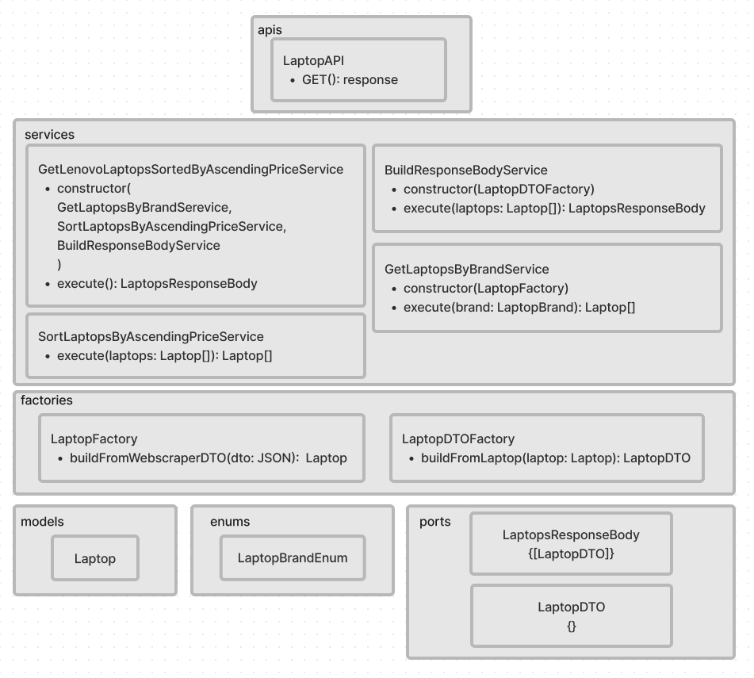
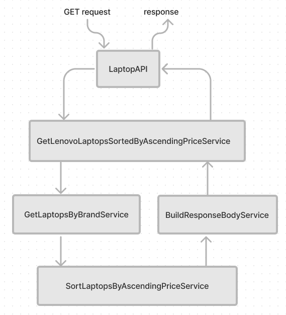
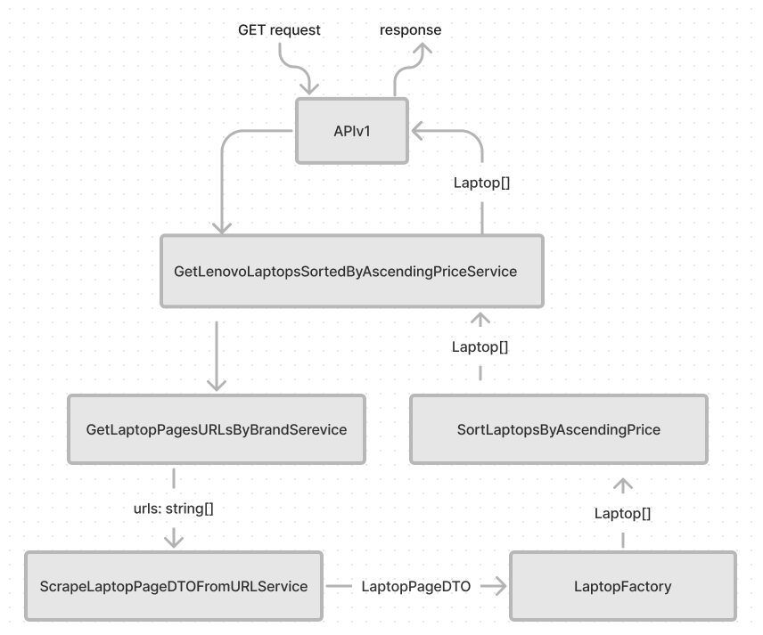

# laptop-crawler-challange
Desafio requisitado para uma entrevista de emprego (tornarei o repositório privado quando finalizar o teste)

## Uso
[Node](https://nodejs.org/en/) >=6.0.0

Clone o repositório
```
git clone git@github.com:fr-mm/laptop-crawler-challange.git
```

Instale as dependências
```
npm i
```

Rode os testes para garantir que tudo está ok
```
npm test
```

Inicie o servidor
```
npm start
```

Acesse ou mande uma GET request para
```
http://localhost:4000/lenovo
```


## O desafio
Acessar esse site e pegar todos notebooks Lenovo ordenando do mais barato para o mais caro. 
Pegar todos os dados disponíveis dos produtos.
 
É interessante que o robô possa ser consumido por outros serviços. 
Recomendamos a criação de uma pequena RESTFul API JSON para deixar mais otimizado.
 
- Utilizar Puppeteer ou Playwright.
 
- Criar um repositório no github e nos enviar o link.
 
site:
https://webscraper.io/test-sites/e-commerce/allinone/computers/laptops

## O plano

O sistema será composto por uma RESTful API 
e um serviço central (GetLenovoLaptopsSortedByAscendingPriceService)



O fluxo se dará da seguinte forma:  


As bibliotecas utilizadas serão:
- [Puppeteer](https://github.com/puppeteer/puppeteer), usada pela GetLaptopsByBrandSerevice
- [Express](https://github.com/expressjs/express), usada pela LaptopAPI


## A solução

Ocorreram algumas alterações ao longo do processo. O fluxo final ficou assim:  


## Cronograma

O desafio foi lançado em 4 de Julho de 2022 e entregue em 6 de Julho de 2022

